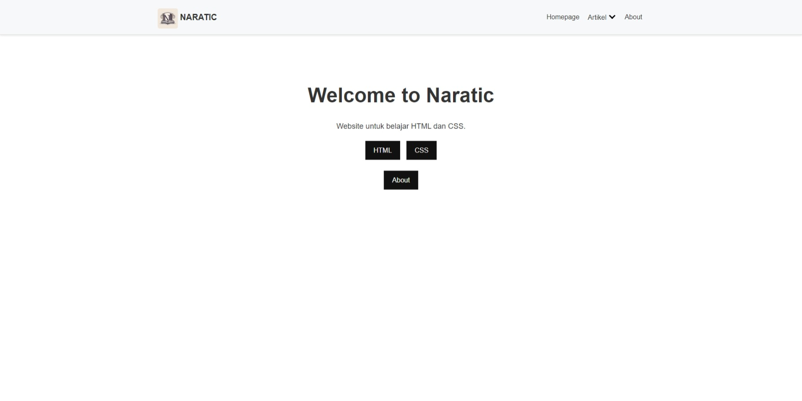

<h1> Naratic</h1> <!-- contoh logo, Anda dapat menggantinya dengan logo Anda sendiri -->

>

<strong>Website yang mengusung tema elegan, minimalis, serta memiliki navigasi yang user-friendly adalah kuncinya.</strong>  Situs ini juga diadaptasi secara maksimal untuk berbagai ukuran layar!

<h2>Daftar Isi</h2>

<ul>
<li><a href="#fitur-keren-di-naratic">Fitur Keren di Naratic</a></li>
<li><a href="#teknologi-yang-memberdayakan-naratic">Teknologi yang Memberdayakan Naratic</a></li>
<li><a href="#jalankan-di-perangkatmu">Jalankan di Perangkatmu</a></li>
<li><a href="#info-penting">Info Penting</a></li>
<li><a href="#pembuat">Pembuat</a></li>
<li><a href="#ingin-ikut-berkontribusi">Ingin Ikut Berkontribusi?</a></li>
<li><a href="#lisensi">Lisensi</a></li>
<li><a href="#demonstrasi-website">Demonstrasi Website</a></li>
<li><a href="#terima-kasih">Terima Kasih!</a></li>
<li><a href="#tips-tambahan">Tips Tambahan</a></li>
</ul>

<h2>Fitur Keren di Naratic</h2>

<ul>
<li><strong>Navigasi Responsif:</strong> Website hadir dengan struktur navigasi yang rapi dan bisa disesuaikan dengan berbagai macam ukuran layar, dari desktop sampai smartphone.</li>
<li><strong>Tombol Menu Interaktif:</strong> Ikon hamburger yang berubah  menjadi "X" ketika menu dibuka. Memberikan sentuhan dinamis!</li>
<li><strong>Dropdown Menu Elegan:</strong> Berisi submenu untuk kategori "Artikel" (dimana ada subkategori lebih lanjut seperti "HTML" dan "CSS"). Praktis dan rapi.</li>
<li><strong>Animasi Transisi:</strong> Menambah daya tarik pada website dan menjadikan transisi elemen menjadi lebih smooth.</li>
<li><strong>Desain Modern:</strong> Desain web modern dan minimalis memberikan tampilan  yang fresh, rapi, dan mudah dinavigasi.</li>
</ul>

<figure><figcaption>Tampilan utama situs web Naratic. Sumber: webflow.com</figcaption></figure> <!-- contoh caption gambar -->

<h2>Teknologi yang Memberdayakan Naratic</h2>

<ul>
<li><strong>HTML5:</strong> Dasar pondasi struktur website</li>
<li><strong>CSS3:</strong> Menjadi jantung untuk gaya dan visual menarik website Naratic.</li>
<li><strong>JavaScript:</strong> Menghidupkan elemen dinamis seperti tombol menu dan efek transisi.</li>
<li><strong>Font Awesome:</strong>  menyediakan kumpulan ikon praktis dan cantik.</li>
<li><strong>Flaticon CDN:</strong> Sumber untuk ikon hamburger dan "X"  yang berkelas.</li>
</ul>

<h2>Jalankan di Perangkatmu!</h2>

<ol>
<li>Clone repository ini ke direktori komputer Anda.</li>
<li>Buka file <code>index.html</code> menggunakan browser favorit Anda.</li>
</ol>

<h2>Info Penting</h2>

<ul>
<li>Koneksi internet stabil dibutuhkan untuk memastikan CDN mengakses ikon dengan benar.</li>
<li>Modifikasi CSS & JavaScript dipersilakan – Sesuaikan Naratic dengan gaya Anda!</li>
</ul>

<h2>Pembuat</h2>

Nojs Nojin / Muhammad Raffi Aqsan

<h2>Ingin Ikut Berkontribusi?</h2>

Fork, buat revisi, dan kirim pull request jika Anda ingin menjadi bagian dari pengembangan Naratic!

<h2>Lisensi</h2>

Proyek ini dilisensikan di bawah Lisensi MIT - lihat file <a href="LICENSE">LICENSE</a> untuk detailnya.

<h2>Demonstrasi Website</h2>

Anda dapat melihat demonstrasi website Naratic di sini: <a href="https://webflow.com/made-in-webflow/demo">https://webflow.com/made-in-webflow/demo</a>

<h2>Terima Kasih! ❤️</h2>

Semoga bermanfaat!

